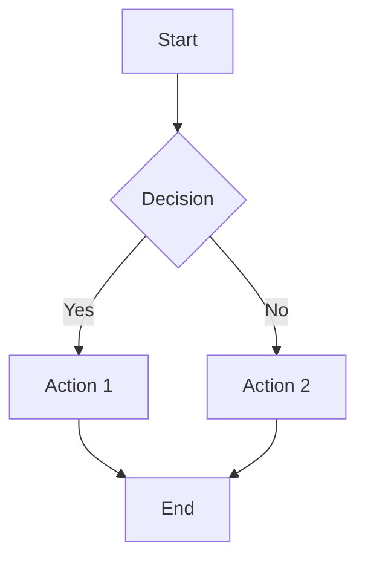
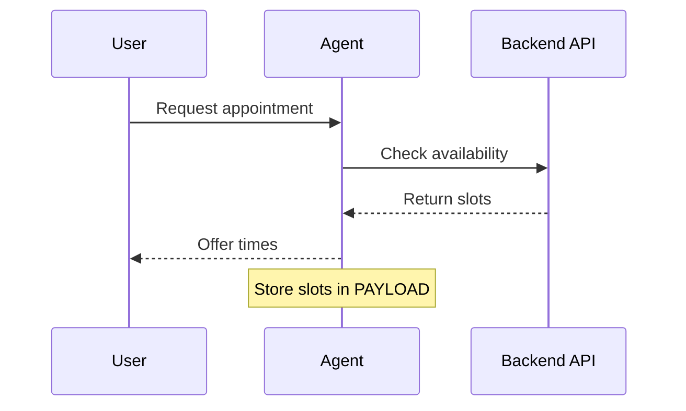
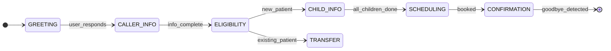
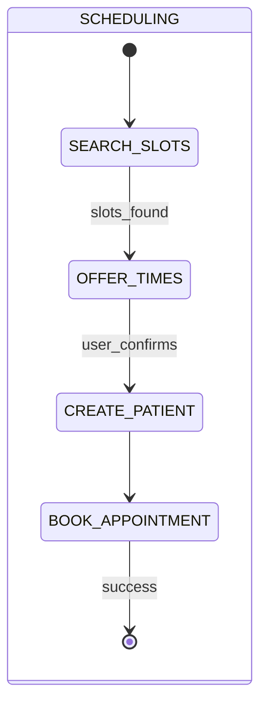

# Best Practices: Mermaid Diagrams, Python Scripting & State Machines in Prompts

> **Created:** 2026-01-06
> **Updated:** 2026-01-06
> **Purpose:** Research-backed guide for using visual diagrams and code as prompting techniques within LLM systems
> **Use Cases:** System prompts, IVA/IVR flows, agentic workflows, documentation

---

## Table of Contents

1. [Research: Diagrams & Code as Prompting Techniques](#1-research-diagrams--code-as-prompting-techniques)
2. [Mermaid Diagram Best Practices](#2-mermaid-diagram-best-practices)
3. [Python Scripting in Prompts](#3-python-scripting-in-prompts)
4. [State Machine Design Patterns](#4-state-machine-design-patterns)
5. [XML/JSON Structured Prompting](#5-xmljson-structured-prompting)
6. [Chain-of-Thought Prompting for Code](#6-chain-of-thought-prompting-for-code)
7. [Implementation Examples](#7-implementation-examples)
8. [Resource Links](#8-resource-links)

---

## 1. Research: Diagrams & Code as Prompting Techniques

This section summarizes peer-reviewed research and empirical studies on using flowcharts, pseudo-code, and state diagrams as prompting techniques to control LLM behavior.

### 1.1 Pseudo-Code Prompting Research

#### IBM Research Study (EMNLP 2023)

**Paper:** "Prompting with Pseudo-Code Instructions"
**Source:** [arXiv:2305.11790](https://arxiv.org/abs/2305.11790) | [OpenReview](https://openreview.net/forum?id=2prcotJejU)

**Key Finding:** Pseudo-code prompts outperform natural language prompts significantly.

| Metric | Natural Language | Pseudo-Code | Improvement |
|--------|-----------------|-------------|-------------|
| F1 Score (Classification) | Baseline | +7-16 points | **7-16%** |
| Task Accuracy (132 tasks) | Baseline | +12-38% relative | **12-38%** |

**Why It Works:**
- Pseudo-code eliminates ambiguity inherent in natural language
- Structured algorithmic format provides clarity
- Aligns model reasoning with algorithmic logic
- Creates modular, interpretable problem-solving approach

**Best Practices from Research:**
- Use simple coding constructs
- Avoid nested loops and recursive functions
- Keep pseudo-code readable and linear

#### Graph Reasoning with Pseudo-Code (2024)

**Paper:** "Graph Reasoning with Large Language Models via Pseudo-code Prompting"
**Source:** [arXiv:2409.17906](https://arxiv.org/html/2409.17906v1)

**Finding:** Pseudo-code prompts enhance LLM performance on graph-related tasks across GPT-3.5 and Mixtral models. However, performance declines as graph complexity increases.

---

### 1.2 Program of Thoughts (PoT) Prompting

**Paper:** "Program of Thoughts Prompting: Disentangling Computation from Reasoning"
**Source:** [OpenReview](https://openreview.net/forum?id=YfZ4ZPt8zd) | [GitHub](https://github.com/wenhuchen/Program-of-Thoughts)

**Core Innovation:** Separates reasoning (LLM) from computation (Python interpreter).

| Dataset | Chain-of-Thought | Program of Thoughts | Improvement |
|---------|-----------------|---------------------|-------------|
| GSM8K | 63.1% | 71.6% | **+8.5%** |
| GSM8K (self-consistency) | 78.0% | 80.0% | **+2.0%** |
| AQuA | 45.3% | 54.1% | **+8.8%** |
| **Average across 8 datasets** | Baseline | +12% | **~12%** |

**How It Works:**
1. LLM generates Python code expressing reasoning steps
2. External Python interpreter executes the code
3. Results feed back into LLM's reasoning process

**Best Use Cases:**
- Math word problems
- Financial reasoning
- Any task requiring exact computation

---

### 1.3 Flowchart-Based Prompting Research

#### FlowBench Study (2024)

**Paper:** "FlowBench: Revisiting and Benchmarking Workflow-Guided Planning for LLM-based Agents"
**Source:** [arXiv:2406.14884](https://arxiv.org/html/2406.14884v1) | [PromptLayer](https://www.promptlayer.com/research-papers/flowbench-revisiting-and-benchmarking-workflow-guided-planning-for-llm-based-agents)

**Key Finding:** Flowcharts outperform text and code for workflow guidance.

| Format | Effectiveness | Token Efficiency | User-Friendliness |
|--------|--------------|------------------|-------------------|
| Natural Language Text | Moderate | Low (verbose) | High |
| Symbolic Code | High | High | Low (requires coding) |
| **Visual Flowcharts** | **Highest** | **High** | **High** |

**Why Flowcharts Work Best:**
- Visual organization helps LLMs understand step sequences
- Structured symbols enhance precision
- Clear representation of branching logic
- Easy for non-coders to create and edit

#### LLMermaid Framework

**Source:** [GitHub - fladdict/llmermaid](https://github.com/fladdict/llmermaid)

**Approach:** Uses Mermaid flowcharts in system prompts to guide multi-step agent behavior.

**Key Rules for Flowchart-Guided Agents:**
1. Agent must strictly follow Mermaid diagram instructions
2. Never change instructions without user permission
3. Never summarize diagrams (loses details)
4. Display current step at beginning of every output

**Benefits:**
- Intuitive at-a-glance process understanding
- Simplifies branching and loop operations
- Reduces execution errors
- Achieves efficient task processing

---

### 1.4 StateFlow: State Machines for LLM Control

**Paper:** "StateFlow: Enhancing LLM Task-Solving through State-Driven Workflows"
**Source:** [arXiv:2403.11322](https://arxiv.org/html/2403.11322v1)

**Key Finding:** State machine prompting reduces costs 4-6x while improving performance.

| Metric | Traditional Prompting | StateFlow | Improvement |
|--------|----------------------|-----------|-------------|
| Cost | Baseline | 4-6x reduction | **75-83% savings** |
| Task Performance | Baseline | Improved | **Better accuracy** |

**How StateFlow Works:**
- Models LLM workflows as Finite State Machines (FSM)
- Each reasoning step maps to a state
- Different instructions sent at different states
- Separates "process grounding" from "sub-task solving"

**Architecture:**
```
State → Instructions → LLM Response → Event → Next State
```

---

### 1.5 Code Prompting Techniques

**Source:** [Learn Prompting - Code Prompting](https://learnprompting.org/docs/new_techniques/code_prompting)

**Definition:** Transforms natural language tasks into code representations. The model uses code as structured input format—not for execution, but for reasoning.

**Variants:**

| Technique | Description | Best For |
|-----------|-------------|----------|
| **Code Prompting** | NL → Code representation for reasoning | Conditional reasoning |
| **Program of Thoughts (PoT)** | Generate + execute Python | Numerical computation |
| **Chain-of-Code (CoC)** | Pseudocode with "LMulator" fallback | Semantic sub-tasks |
| **Structured CoT (SCoT)** | Control flow in reasoning | Code generation |

---

### 1.6 Structured Chain-of-Thought for Code

**Paper:** "Structured Chain-of-Thought Prompting for Code Generation"
**Source:** [ACM TOSEM](https://dl.acm.org/doi/10.1145/3690635) | [Semantic Scholar](https://www.semanticscholar.org/paper/Structured-Chain-of-Thought-Prompting-for-Code-Li-Li/94beb9f249d6d2f1c00d8edfa2db861633aee6f9)

**Key Finding:** Incorporating program structures into reasoning reduces bugs by 31%.

| Approach | Bug Reduction | Developer Preference |
|----------|--------------|---------------------|
| Standard CoT | Baseline | Lower |
| **Structured CoT** | **-31%** | **Higher** |

**How SCoT Works:**
1. Encode control flow (sequence, branch, loop) into reasoning steps
2. LLM generates CoT using programming structures
3. Then outputs code following the structured reasoning

**Human Evaluation:** Developers prefer SCoT-generated programs over standard CoT outputs.

---

### 1.7 Conversation Routines Framework

**Paper:** "Conversation Routines: A Prompt Engineering Framework for Task-Oriented Dialog Systems"
**Source:** [arXiv:2501.11613](https://arxiv.org/html/2501.11613v1)

**Application:** Uses flowchart-based prompts for task-oriented dialog (IVR, customer service).

**Key Insight:** Flowcharts embedded in prompts can be visualized by prompting LLMs to generate Mermaid representations, creating a self-documenting system.

---

### 1.8 Summary: Research-Backed Performance Gains

| Technique | Performance Gain | Source |
|-----------|-----------------|--------|
| Pseudo-code prompting | +7-16% F1, +12-38% relative | IBM Research |
| Program of Thoughts | +12% avg over CoT | PoT Paper |
| Flowchart guidance | Best of 3 formats tested | FlowBench |
| StateFlow (state machines) | 4-6x cost reduction | StateFlow Paper |
| Structured CoT | -31% bugs | ACM TOSEM |
| XML structure | -27% hallucination | ElevenLabs |

**Conclusion:** Embedding diagrams and code in prompts is not just stylistic—it's backed by empirical research showing significant improvements in accuracy, cost efficiency, and output quality.

---

## 2. Mermaid Diagram Best Practices

### 2.1 Core Syntax Principles

Mermaid enables text-to-diagram rendering directly in Markdown, making it ideal for version-controlled documentation and LLM prompts.

**Key Guidelines:**

| Principle | Description |
|-----------|-------------|
| **Declaration First** | Always start with diagram type (`flowchart`, `stateDiagram-v2`, `sequenceDiagram`) |
| **Avoid Reserved Words** | Never use lowercase `end` in flowcharts - capitalize as `End` or `END` |
| **Comment Syntax** | Use `%%` for comments that the parser ignores |
| **Init Directive** | Configure themes/styles at top: `%%{init: {...}}%%` |

### 2.2 Flowchart Best Practices



**Tips:**
- Use `TD` (top-down) or `LR` (left-right) for direction
- Subgraphs for grouping related nodes
- Limit to 15-20 nodes per diagram for readability
- Use descriptive labels on edges (`-->|label|`)

### 2.3 Sequence Diagram Best Practices



**Tips:**
- Define participants with aliases for readability
- Use `-->>`for async responses, `->>` for sync
- Add `Note over` for contextual annotations
- Keep participant count under 6

### 2.4 State Diagram Best Practices



**Key Features:**
- `[*]` denotes start/end states
- `direction LR` for left-to-right layout
- Use `<<choice>>` for decision points
- `<<fork>>` and `<<join>>` for parallel states
- Notes: `note right of State : Text`

### 2.5 Styling & Theming

```
%%{init: {
  "theme": "default",
  "themeVariables": {
    "primaryColor": "#ffdead",
    "primaryTextColor": "#000"
  }
}}%%
```

**Style Classes:**
```mermaid
classDef errorState fill:#f96,stroke:#333,stroke-width:2px
class TRANSFER errorState
```

### 2.6 ASCII Diagrams in Prompts

For prompts where Mermaid rendering isn't available, use ASCII:

```
┌─────────────────────────────────────────────────────┐
│                    STATE DIAGRAM                     │
├─────────────────────────────────────────────────────┤
│  START ──► GREETING ──► CALLER_INFO ──► ELIGIBILITY │
│                              │                │      │
│                              ▼                ▼      │
│                         CHILD_INFO ──► SCHEDULING    │
└─────────────────────────────────────────────────────┘
```

---

## 3. Python Scripting in Prompts

### 3.1 Why Python in Prompts Works

Python code within prompts provides:
- **Unambiguous Logic**: Precise state transitions
- **Pattern Recognition**: LLMs trained extensively on Python
- **Executable Mental Model**: Clear if/elif/else structures
- **Type Hints**: Signal expected data shapes

### 3.2 State Transition Functions

```python
def next_state(current: str, event: str) -> str:
    """
    Determine next state based on current state and event.
    Wildcards (*) match any state.
    """
    transitions = {
        ("GREETING", "user_responds"): "CALLER_INFO",
        ("CALLER_INFO", "info_complete"): "ELIGIBILITY",
        ("ELIGIBILITY", "new_patient"): "CHILD_INFO",
        ("ELIGIBILITY", "existing_patient"): "TRANSFER",
        ("*", "transfer_trigger"): "TRANSFER",
        ("*", "cancel_detected"): "END"
    }

    # Check specific transition first
    result = transitions.get((current, event))
    if result:
        return result

    # Check wildcard transitions
    return transitions.get(("*", event), current)
```

### 3.3 Validation Logic

```python
def validate_child_age(birth_date: str, current_date: str) -> dict:
    """
    Validate child is within acceptable age range (7-20).
    Returns validation result with next action.
    """
    from datetime import datetime

    dob = datetime.strptime(birth_date, "%m/%d/%Y")
    today = datetime.strptime(current_date, "%Y-%m-%d")
    age = (today - dob).days // 365

    if 7 <= age <= 20:
        return {"valid": True, "age": age, "action": "continue"}
    elif age < 7:
        return {"valid": False, "age": age, "action": "TRANSFER",
                "reason": "too_young"}
    else:
        return {"valid": False, "age": age, "action": "TRANSFER",
                "reason": "too_old"}
```

### 3.4 Prompt Engineering for Python Code Generation

**Best Practices from Research:**

1. **Be Specific**: Don't be vague - tell the LLM exactly what the code should do
2. **Persona Assignment**: "You are a senior Python developer following PEP 8"
3. **Explain First**: Ask LLM to explain strategy before generating code
4. **Import Hints**: Starting with `import` signals Python context
5. **Type Annotations**: Include typing for clarity

**Example Prompt Pattern:**
```
You are a Python developer. Before writing code:
1. Explain your approach in 2-3 sentences
2. Identify edge cases
3. Then write the function with type hints

Task: Create a date validation function for appointment scheduling.
Requirements:
- Accept date string in MM/DD/YYYY format
- Validate date is not in past
- Return structured response with valid/invalid status
```

---

## 4. State Machine Design Patterns

### 4.1 Core Components

| Component | Purpose | Example |
|-----------|---------|---------|
| **States** | Discrete conversation phases | GREETING, SCHEDULING |
| **Events** | Triggers for transitions | user_confirms, api_success |
| **Transitions** | State-to-state mappings | GREETING → CALLER_INFO |
| **Guards** | Conditional transitions | if age >= 7 |
| **Actions** | Side effects on transition | call_api(), store_data() |

### 4.2 State Definition Table

```markdown
| State | Entry Condition | Actions | Exit Condition |
|-------|-----------------|---------|----------------|
| GREETING | Call starts | Say greeting | User responds |
| CALLER_INFO | After greeting | Get name, phone | All collected |
| SCHEDULING | Account done | Call API, offer times | Booked |
| TRANSFER | Trigger detected | Transfer phrase | Call handed off |
```

### 4.3 LLM State Machine Libraries

**Python Libraries for LLM Agents:**

1. **llmstatemachine** (Robocorp)
   - Chat history as memory
   - JSON function definitions
   - State-restricted actions

2. **Stately Agent** (XState)
   - State machines + observations
   - Feedback loops
   - Decision improvement over time

3. **python-statemachine**
   - Pythonic API
   - Guards and validators
   - Async support

4. **transitions** (pytransitions)
   - Lightweight FSM
   - Flexible patterns
   - Extension support

### 4.4 Composite States

For complex flows, use hierarchical states:



---

## 5. XML/JSON Structured Prompting

### 5.1 Benefits of Structured Prompts

| Benefit | Description |
|---------|-------------|
| **Clarity** | Separate different prompt sections |
| **Accuracy** | 27% reduction in hallucination |
| **Parseability** | Easy post-processing |
| **Maintainability** | Version control friendly |

### 5.2 XML Prompting (Claude-Optimized)

Claude was specifically trained with XML tags:

```xml
<system_prompt>
  <identity>
    <name>Allie</name>
    <role>Scheduling Assistant</role>
  </identity>

  <rules priority="absolute">
    <rule id="A1">One question per turn</rule>
    <rule id="A2">Never say: sorry, unfortunately, cannot</rule>
  </rules>

  <workflow>
    <state name="GREETING">
      <entry>Call starts</entry>
      <action>Greet caller warmly</action>
      <exit trigger="user_responds">CALLER_INFO</exit>
    </state>
  </workflow>
</system_prompt>
```

### 5.3 Rule Hierarchy Pattern

```xml
<rules>
  <tier level="1" name="ABSOLUTE">
    <!-- Never override these -->
    <rule id="A1">Security constraints</rule>
  </tier>

  <tier level="2" name="CRITICAL">
    <!-- Override only by Tier 1 -->
    <rule id="C1">Business logic</rule>
  </tier>

  <tier level="3" name="GUIDANCE">
    <!-- Can be overridden when appropriate -->
    <rule id="G1">Style preferences</rule>
  </tier>
</rules>
```

### 5.4 When to Use XML vs JSON

| Use Case | Recommended Format |
|----------|-------------------|
| System prompts | XML (better hierarchy) |
| Data extraction | JSON (code-friendly) |
| Tool definitions | JSON (API standard) |
| Complex instructions | XML (human-readable) |
| Classification | JSON (efficient) |

---

## 6. Chain-of-Thought Prompting for Code

### 6.1 Standard CoT vs Structured CoT

**Standard CoT:**
- "Let's think step by step"
- Natural language reasoning

**Structured CoT (SCoT):**
- Encodes control flow into reasoning
- Explicitly uses programming structures
- 31% reduction in bugs

### 6.2 SCoT Pattern

```markdown
Before generating code, structure your thinking:

1. **SEQUENCE**: List steps in order
   - Step 1: Validate input
   - Step 2: Query API
   - Step 3: Process response

2. **BRANCH**: Identify conditionals
   - IF success → continue
   - ELSE IF retry → loop
   - ELSE → error handling

3. **LOOP**: Define iterations
   - FOR each child in list
   - WHILE slots available

4. **GENERATE**: Write code following structure
```

### 6.3 Adaptive Reasoning

Research shows adaptive approaches can match performance with 70% fewer tokens:

| Mode | When to Use | Token Cost |
|------|-------------|------------|
| **Fast Thinking** | Simple/direct answers | Low |
| **Slow Thinking** | Complex reasoning | High |
| **Adaptive** | Context-dependent | Optimal |

---

## 7. Implementation Examples

### 7.1 Complete State Machine Prompt Section

```markdown
## FINITE STATE MACHINE

### State Diagram (ASCII)
┌──────────────────────────────────────────┐
│  START ──► GREETING ──► CALLER_INFO      │
│                              │           │
│                              ▼           │
│                         ELIGIBILITY      │
│                          /      \        │
│                         ▼        ▼       │
│                    CHILD_INFO  TRANSFER  │
│                         │                │
│                         ▼                │
│                    SCHEDULING ──► END    │
└──────────────────────────────────────────┘

### Transition Logic
```python
def next_state(current, event):
    transitions = {
        ("GREETING", "user_responds"): "CALLER_INFO",
        ("ELIGIBILITY", "new_patient"): "CHILD_INFO",
        ("ELIGIBILITY", "existing_patient"): "TRANSFER",
        ("*", "cancel"): "END"
    }
    return transitions.get((current, event), current)
```

### State Table
| State | Entry | Actions | Exit |
|-------|-------|---------|------|
| GREETING | call_start | say_hello() | user_responds |
```

### 7.2 Voice AI Prompt with All Patterns

```xml
<system_prompt version="v65">
  <!-- Identity -->
  <agent>
    <name>Allie</name>
    <voice>Friendly, warm, efficient</voice>
  </agent>

  <!-- State Machine (ASCII) -->
  <state_diagram>
    START ──► GREETING ──► CALLER_INFO ──► SCHEDULING ──► END
  </state_diagram>

  <!-- Transition Logic (Python) -->
  <transitions language="python">
    def next_state(current, event):
        return TRANSITIONS.get((current, event), current)
  </transitions>

  <!-- Hierarchical Rules -->
  <rules>
    <absolute>
      <rule id="A1">One question per turn</rule>
    </absolute>
    <critical>
      <rule id="C1">Never re-ask collected info</rule>
    </critical>
  </rules>
</system_prompt>
```

---

## 8. Resource Links

### Research Papers & Studies

| Paper/Study | Topic | URL |
|-------------|-------|-----|
| Prompting with Pseudo-Code Instructions (IBM) | Pseudo-code prompting | https://arxiv.org/abs/2305.11790 |
| Pseudo-Code Prompting (OpenReview) | Pseudo-code prompting | https://openreview.net/forum?id=2prcotJejU |
| Graph Reasoning via Pseudo-code | Pseudo-code for graphs | https://arxiv.org/html/2409.17906v1 |
| Program of Thoughts Prompting | Code-based reasoning | https://openreview.net/forum?id=YfZ4ZPt8zd |
| Program of Thoughts (GitHub) | PoT implementation | https://github.com/wenhuchen/Program-of-Thoughts |
| FlowBench | Flowchart-based prompting | https://arxiv.org/html/2406.14884v1 |
| StateFlow | State machine LLM control | https://arxiv.org/html/2403.11322v1 |
| Structured CoT for Code (ACM) | SCoT for code generation | https://dl.acm.org/doi/10.1145/3690635 |
| Conversation Routines | Dialog flowcharts | https://arxiv.org/html/2501.11613v1 |
| Prompt Design & Engineering | Comprehensive survey | https://arxiv.org/html/2401.14423v4 |
| Systematic Survey of Prompt Engineering | Technique taxonomy | https://arxiv.org/html/2402.07927v1 |

### Flowchart & Diagram Tools for LLMs

| Resource | URL |
|----------|-----|
| LLMermaid (Flowchart Agent Control) | https://github.com/fladdict/llmermaid |
| DiagrammerGPT (Academic) | https://diagrammergpt.github.io/ |
| Microsoft Prompt Flow | https://learn.microsoft.com/en-us/azure/ai-foundry/concepts/prompt-flow |
| AI Prompt Flow (Lucidchart) | https://lucid.co/marketplace/1d2a2200/ai-prompt-flow |
| Stately Agent Documentation | https://stately.ai/docs/agents |
| LLM-State-Machine (GitHub) | https://github.com/jsz-05/LLM-State-Machine |

### Code Prompting Techniques

| Resource | URL |
|----------|-----|
| Code Prompting (Learn Prompting) | https://learnprompting.org/docs/new_techniques/code_prompting |
| Program-Aided Language Models | https://cameronrwolfe.substack.com/p/program-aided-language-models |
| PoT Prompting Guide (PromptHub) | https://www.prompthub.us/blog/program-of-thoughts-prompting-guide |
| Martin Fowler: LLM Prompting for Programming | https://martinfowler.com/articles/2023-chatgpt-xu-hao.html |
| LLM Prompting Techniques for Developers | https://www.pedroalonso.net/blog/llm-prompting-techniques-developers/ |
| Prompt Engineering for LLM Reasoning | https://latitude-blog.ghost.io/blog/complete-guide-to-prompt-engineering-for-llm-reasoning/ |

### Official Documentation

| Resource | URL |
|----------|-----|
| Mermaid Official Docs | https://mermaid.js.org/intro/syntax-reference.html |
| Mermaid Live Editor | https://mermaid.live |
| Mermaid Flowchart Syntax | https://docs.mermaidchart.com/mermaid-oss/syntax/flowchart.html |
| Mermaid State Diagrams | https://mermaid.ai/open-source/syntax/stateDiagram.html |
| Mermaid Sequence Diagrams | https://docs.mermaidchart.com/mermaid-oss/syntax/sequenceDiagram.html |

### Prompt Engineering Guides

| Resource | URL |
|----------|-----|
| Anthropic Claude Best Practices | https://docs.claude.com/en/docs/build-with-claude/prompt-engineering/claude-4-best-practices |
| Anthropic XML Tags Guide | https://platform.claude.com/docs/en/build-with-claude/prompt-engineering/use-xml-tags |
| Claude Code Best Practices | https://www.anthropic.com/engineering/claude-code-best-practices |
| Anthropic Interactive Tutorial | https://github.com/anthropics/prompt-eng-interactive-tutorial |
| OpenAI Prompt Engineering | https://platform.openai.com/docs/guides/prompt-engineering |
| Prompt Engineering Guide (DAIR) | https://www.promptingguide.ai/ |
| IBM 2025 Prompt Guide | https://www.ibm.com/think/prompt-engineering |

### Python & Code Generation

| Resource | URL |
|----------|-----|
| Real Python Prompt Engineering | https://realpython.com/practical-prompt-engineering/ |
| Python LLM Prompting (Medium) | https://medium.com/@sohaibmalikdev/prompting-llms-for-programming-code-completion-python-focused-d7294da0074f |
| Microsoft prompt-engine-py | https://github.com/microsoft/prompt-engine-py |
| Hugging Face Prompting | https://huggingface.co/docs/transformers/main/tasks/prompting |

### State Machine Libraries

| Resource | URL |
|----------|-----|
| llmstatemachine (Robocorp) | https://github.com/robocorp/llmstatemachine |
| Stately Agent (XState) | https://github.com/statelyai/agent |
| python-statemachine | https://pypi.org/project/python-statemachine/ |
| transitions (pytransitions) | https://github.com/pytransitions/transitions |
| State Pattern (Refactoring Guru) | https://refactoring.guru/design-patterns/state/python/example |

### Chain-of-Thought Research

| Resource | URL |
|----------|-----|
| Structured CoT for Code (ACM) | https://dl.acm.org/doi/10.1145/3690635 |
| Original CoT Paper (arXiv) | https://arxiv.org/abs/2201.11903 |
| Reasoning as Resource (arXiv) | https://arxiv.org/html/2506.09396v1 |
| CoT Comprehensive Guide (orq.ai) | https://orq.ai/blog/what-is-chain-of-thought-prompting |
| CoT Value Research (Wharton) | https://gail.wharton.upenn.edu/research-and-insights/tech-report-chain-of-thought/ |

### XML/JSON Structured Prompting

| Resource | URL |
|----------|-----|
| XML & JSON Prompting Guide | https://codeconductor.ai/blog/structured-prompting-techniques-xml-json/ |
| Claude XML Tags | https://docs.claude.com/en/docs/build-with-claude/prompt-engineering/use-xml-tags |
| XML Prompt Engineering (Medium) | https://medium.com/@TechforHumans/effective-prompt-engineering-mastering-xml-tags-for-clarity-precision-and-security-in-llms-992cae203fdc |
| AWS Bedrock Structured Data | https://aws.amazon.com/blogs/machine-learning/structured-data-response-with-amazon-bedrock-prompt-engineering-and-tool-use/ |

### Mermaid Cheatsheets & Tutorials

| Resource | URL |
|----------|-----|
| Mastering Mermaid (DEV.to) | https://dev.to/nagasuresh_dondapati_d5df/mastering-mermaid-a-comprehensive-cheat-sheet-45mi |
| GitHub Mermaid Cheatsheet | https://github.com/JakeSteam/Mermaid |
| Mermaid Cheat Sheet (jojozhuang) | https://jojozhuang.github.io/tutorial/mermaid-cheat-sheet/ |
| Comprehensive Mermaid Guide | https://antoinegriffard.com/posts/mermaid-js-comprehensive-guide/ |
| Mermaid Flowchart Tips | https://www.kallemarjokorpi.fi/blog/mastering-diagramming-as-code-essential-mermaid-flowchart-tips-and-tricks-2/ |
| draw.io Mermaid Integration | https://www.drawio.com/blog/mermaid-diagrams |

### AI Diagram Generation

| Resource | URL |
|----------|-----|
| Creating Diagrams with Claude | https://thenewstack.io/how-to-create-software-diagrams-with-chatgpt-and-claude/ |
| Mermaid AI | https://docs.mermaidchart.com/blog/posts/mermaid-ai-is-here-to-change-the-game-for-diagram-creation |
| Claude Mermaid Prompts | https://www.dakaiai.app/claude-prompt-for-generating-mermaid-diagram/ |
| Eraser AI Mermaid Editor | https://www.eraser.io/ai/mermaid-diagram-editor |
| LLM + Mermaid for UML | https://mike-vincent.medium.com/llm-mermaid-how-modern-teams-create-uml-diagrams-without-lucidchart-e54c56350804 |

### Design Patterns for AI

| Resource | URL |
|----------|-----|
| Design Patterns for AI Engineers | https://www.unite.ai/design-patterns-in-python-for-ai-and-llm-engineers-a-practical-guide/ |
| 3 Essential Patterns for LLM | https://medium.com/@ethanbrooks42/level-up-your-python-with-3-essential-design-patterns-for-ai-and-llm-projects-525597fad295 |
| State Pattern in Python (Auth0) | https://auth0.com/blog/state-pattern-in-python/ |
| Python Patterns & Idioms | https://python-3-patterns-idioms-test.readthedocs.io/en/latest/StateMachine.html |

---

## Summary

### Research-Backed Findings

When implementing Mermaid diagrams, Python logic, and state machines in prompts, research demonstrates significant improvements:

| Technique | Improvement | Source |
|-----------|-------------|--------|
| Pseudo-code prompting | +7-16% F1, +12-38% task accuracy | IBM (EMNLP 2023) |
| Program of Thoughts | +12% over Chain-of-Thought | PoT Paper |
| Flowchart guidance | Best format vs text/code | FlowBench (2024) |
| StateFlow (FSM prompting) | 4-6x cost reduction | StateFlow Paper |
| Structured CoT | -31% bugs in generated code | ACM TOSEM |
| XML structure | -27% hallucination | ElevenLabs |

### Best Practices

1. **Use flowcharts in prompts** - Research shows they outperform both natural language and code for workflow guidance
2. **Embed Python/pseudo-code** for state transitions - Eliminates natural language ambiguity (+7-16% F1)
3. **Separate reasoning from computation** - Program of Thoughts pattern improves numerical accuracy by 12%
4. **Model workflows as state machines** - StateFlow achieves 4-6x cost reduction with better performance
5. **Use Structured CoT for code generation** - Reduces bugs by 31%, developers prefer the output
6. **ASCII diagrams for portability** - When Mermaid rendering isn't available
7. **XML structure for rules** - Reduces hallucination by 27%
8. **State tables complement diagrams** - Structured entry/exit conditions
9. **Tiered rules** (Absolute → Critical → Guidance) create clear priority
10. **Test in Mermaid Live Editor** before embedding in prompts

### Key Insight

The combination of **visual diagrams + executable pseudo-code + structured rules** is not just stylistic preference—it's backed by peer-reviewed research showing significant, measurable improvements in LLM accuracy, reliability, and cost efficiency.

**This approach is implemented in this project's IVA system prompt (v65)**, which uses:
- ASCII state diagrams for flow visualization
- Python transition functions for unambiguous logic
- XML-structured hierarchical rules
- State definition tables for entry/exit conditions
